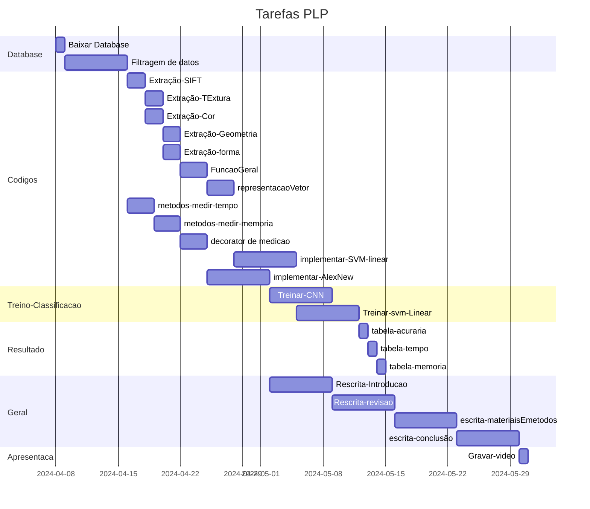

## Tabela de Resposabilidade

| Section              | Tarefa                    | Desc                                                                                                                                                         | Emanuel | Jose | feito |
| -------------------- | ------------------------- | ------------------------------------------------------------------------------------------------------------------------------------------------------------ | ------- | ---- | ----- |
| Database             | Baixar Database           |                                                                                                                                                              | [x]     | [ ]  | x     |
| Database             | Filtragem de dados        |                                                                                                                                                              | [x]     | [x]  |       |
| Codigos              | Extração-SIFT             | [https://doi.org/10.1016/j.biosystemseng.2009.07.002](https://doi.org/10.1016/j.biosystemseng.2009.07.002 "Persistent link using digital object identifier") | []      | [x]  |       |
| Codigos              | Extração-Textura          | [GLCM]https://sci-hub.se/10.13031/2013.26977                                                                                                                 | []      | [x]  |       |
| Codigos              | Extração-Cor              | https://sci-hub.se/10.13031/2013.26977                                                                                                                       | []      | [x]  |       |
| Codigos              | Extração-Geometria        | https://sci-hub.se/10.1109/ICICI.2017.8365226                                                                                                                | [x]     | []   |       |
| Codigos              | Extração-forma            | https://sci-hub.se/10.1109/ICICI.2017.8365226                                                                                                                | [x]     | []   |       |
| Codigos              | FuncaoGeral               |                                                                                                                                                              | [x]     | [x]  |       |
| Codigos              | representacaoVetor        |                                                                                                                                                              | [x]     | [x]  |       |
| Codigos              | metodos-medir-tempo       |                                                                                                                                                              | []      | [x]  |       |
| Codigos              | metodos-medir-memoria     |                                                                                                                                                              | [x]     | []   |       |
| Codigos              | decorator de medicao      |                                                                                                                                                              | [x]     | []   |       |
| Codigos              | implementar-SVM-linear    |                                                                                                                                                              | []      | [x]  |       |
| Codigos              | implementar-AlexNew       |                                                                                                                                                              | [x]     | []   |       |
| Treino-Classificacao | Treinar-CNN               |                                                                                                                                                              | [x]     | []   |       |
| Treino-Classificacao | Treinar-svm-Linea         |                                                                                                                                                              | [x]     | []   |       |
| Resultado            | tabela-acuraria           |                                                                                                                                                              | [x]     | [x]  |       |
| Resultado         | tabela-tempo              |                                                                                                                                                              | [x]     | [x]  |       |
| Resultado            | tabela-memoria            |                                                                                                                                                              | [x]     | [x]  |       |
| Geral                | Rescrita-Introducao       |                                                                                                                                                              | [ ]     | [x]  |       |
| Geral                | Rescrita-revisao          |                                                                                                                                                              | [ ]     | [x]  |       |
| Geral                | escrita-materiaisEmetodos |                                                                                                                                                              | [ ]     | [x]  |       |
| Geral                | escrita-conclusão         |                                                                                                                                                              | [x]     | [x]  |       |
| Apresentaca          | Gravar-video              |                                                                                                                                                              | [x]     | [x]  |       |

### Lista de Feito

- [ ] Tudo
	- [ ] Database
		- [x] Baixar
		- [ ] Filtrar
	- [ ] Codigos
		- [ ] SIFT
		- [ ] Cor
		- [ ] Textura
		- [ ] Geometria
		- [ ] forma
		- [ ] Func geral
		- [ ] Representacao Vetor
		- [ ] medir-tempo
		- [ ] medir-memoria
		- [ ] Decorator
		- [ ] SVM
		- [ ] AlexNet
	- [ ] Treino-classifcacao
		- [ ] SVM
		- [ ] AlexNet
	- [ ] Resultado
		- [ ] acc
		- [ ] tempo
		- [ ] memoria
	- [ ] Geral
		- [ ] Introducão
		- [ ] revisão
		- [ ] meterias e metoods
		- [ ] conclsuão
	- [ ] Apresentacao
		- [ ] gravar
		- [ ] editar
		- [ ] publicar