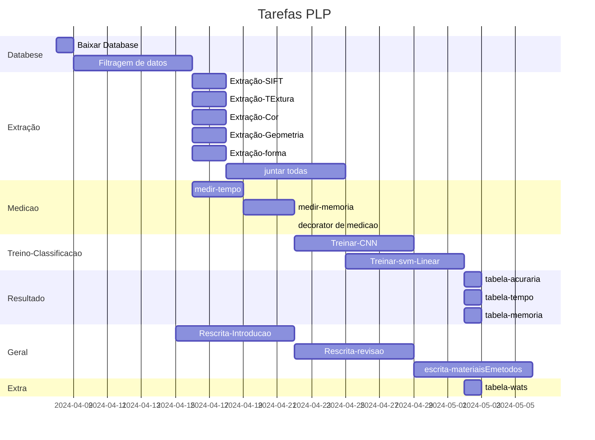

- [ ] DataBase
	- [x] Baixar
	- [ ] FIltragem Dados
- [ ] Extracao
	- [ ] SIFT
	- [ ] Textura
	- [ ] Cor
	- [ ] Geometria
	- [ ] forma
- [ ] Alg-medir
	- [ ] Tempo
	- [ ] Memoria
- [ ] Treino
	- [ ] CNN
	- [ ] SVM
- [ ] Geral
	- [ ] Introducao
		- [x] base
		- [ ] Final
	- [ ] Revisao
		- [x] base
		- [ ] final
	- [ ] Meterias e metodos
		- [ ] base
		- [ ] final
- [ ] Resultados
	- [ ] analise acuraria
	- [ ] analise tempo
	- [ ] analise memoria

